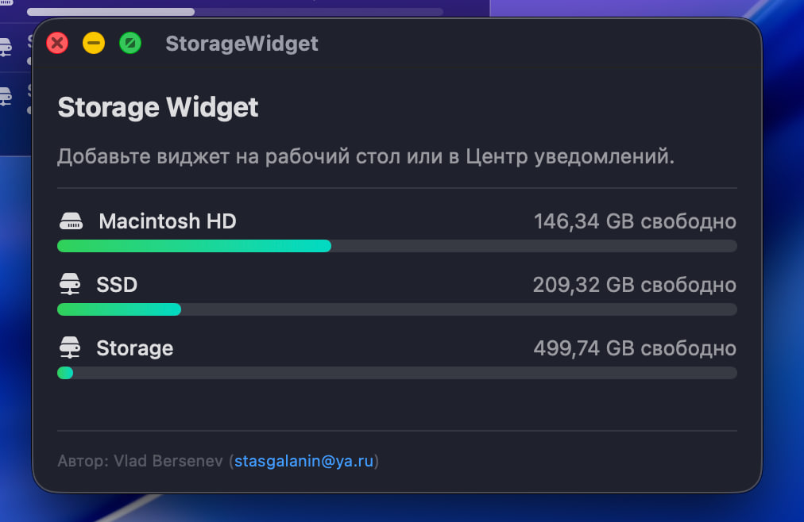
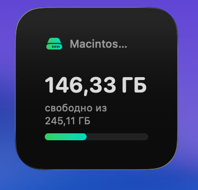
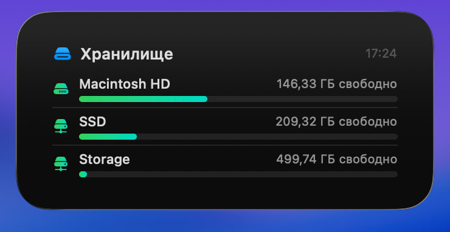
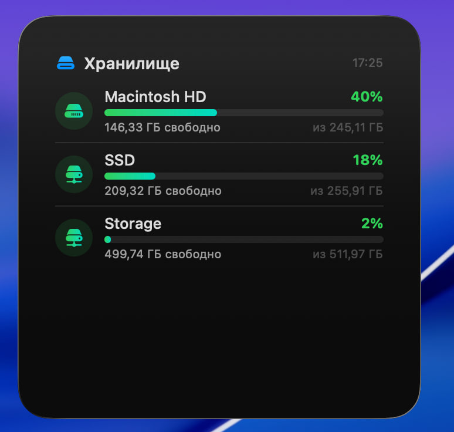

# Storage Widget для macOS

Виджет для рабочего стола macOS, который показывает свободное место на всех подключённых дисках.

**Автор:** Vlad Bersenev (stasgalanin@ya.ru)

---

## Скриншоты

| Приложение | Small | Medium | Large |
|:---:|:---:|:---:|:---:|
|  |  |  |  |

---

## Что умеет

- Показывает свободное и общее место на каждом диске
- Цветовая индикация заполненности (зелёный → жёлтый → оранжевый → красный)
- Три размера виджета: маленький (1 диск), средний (до 3 дисков), большой (все диски)
- Автообновление каждые 15 минут
- Внутренние диски отображаются первыми

---

## Требования

- macOS 14.0 (Sonoma) или новее
- Xcode (бесплатно из App Store)

---

## Установка пошагово

### 1. Установи Xcode

Если Xcode ещё не установлен — открой Terminal и выполни:

```bash
xcode-select --install
```

Это установит базовые инструменты. Но для сборки виджета нужен **полный Xcode**.

Скачай его бесплатно из **App Store** — найди "Xcode" и нажми "Загрузить".

> Xcode весит ~30 ГБ, загрузка может занять время.

### 2. Прими лицензию и выполни первичную настройку

После установки Xcode открой Terminal и выполни две команды (потребуется пароль администратора):

```bash
sudo xcodebuild -license accept
```

```bash
sudo xcodebuild -runFirstLaunch
```

### 3. Скачай проект

Если у тебя есть git:

```bash
git clone <URL_РЕПОЗИТОРИЯ>
cd macox-storage-widget
```

Или просто скопируй папку проекта в любое удобное место и перейди в неё:

```bash
cd /путь/к/папке/macox-storage-widget
```

### 4. Собери проект

```bash
xcodebuild -project StorageWidget.xcodeproj -scheme StorageWidget -configuration Release build
```

Дождись надписи `** BUILD SUCCEEDED **` — это значит всё прошло успешно.

### 5. Найди собранное приложение и скопируй в Applications

```bash
cp -R ~/Library/Developer/Xcode/DerivedData/StorageWidget-*/Build/Products/Release/StorageWidget.app /Applications/
```

### 6. Запусти приложение

```bash
open /Applications/StorageWidget.app
```

> При первом запуске macOS может показать предупреждение безопасности.
> Нажми **"Открыть"**. Если кнопки нет — зайди в **Системные настройки → Конфиденциальность и безопасность** и нажми "Всё равно открыть".

### 7. Добавь виджет на рабочий стол

1. Кликни **правой кнопкой мыши** на рабочем столе
2. Выбери **"Редактировать виджеты..."** (Edit Widgets...)
3. В поиске набери **"Хранилище"** или **"StorageWidget"**
4. Выбери нужный размер и нажми **+** или перетащи на рабочий стол

---

## Всё в одну команду

Если хочешь выполнить шаги 4–6 одной командой, скопируй это в Terminal:

```bash
cd /путь/к/папке/macox-storage-widget && \
xcodebuild -project StorageWidget.xcodeproj -scheme StorageWidget -configuration Release build && \
rm -rf /Applications/StorageWidget.app && \
cp -R ~/Library/Developer/Xcode/DerivedData/StorageWidget-*/Build/Products/Release/StorageWidget.app /Applications/ && \
open /Applications/StorageWidget.app
```

> Не забудь заменить `/путь/к/папке/macox-storage-widget` на реальный путь к папке проекта.

---

## Удаление

1. Удали виджет с рабочего стола (кликни на него → нажми **"−"**)
2. Удали приложение:

```bash
rm -rf /Applications/StorageWidget.app
```
